# Práctica3 
## Jekyll

### 1. Pre requisitos

Instalación de Ruby y para manejar sus dependencias
```
sudo apt-get install ruby
gem install bundler
```

Para la instalación de Jekyll, se sigue la guía dada en la [web oficial][jekyll]

[jekyll]: https://jekyllrb.com/docs/installation/ubuntu/

Una vez realizados todos los pasos allí indicados, se procede a instalar Jekyll
 
```
gem install jekyll bundler
```

### 2. Creación del proyecto

Se realiza la instalación del proyecto básico

```
jekyll new myJekyllWeb
```

y posteriormente para la compilación del proyecto y obtener el sitio en **"_site"**

```
jekyll build
```

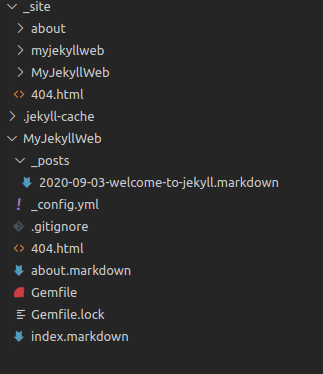

Para este proyecto, se utilizó como guía de construcción el proyecto [Básico en Jekyll][proyectobasico]

[proyectobasico]: https://github.com/jekyll/example

Los componentes en los cuales me basé para la construcción del proyecto fueron:

    - _includes
    - _layouts
    - _sass (unicamente para el footer)

### 3. Componentes del proyecto

Tanto código propio de SASS como el archivo gulpfile fueron añadidos al proyecto.

Se usaron las dependencias de gulp utilizadas anteriormente:

    -Gulp
    -Sass
    -Browser-sync

La uníca dependencia que se agregó nueva fue:

    -Run: Para lanzar comandos directamente en el shell

Con el objetivo de que Gulp se encargue de ejecutar algunas tareas de Jekyll. Si bien, jekyll realiza la compilación de los archivos Sass añadiendole unicamente el Front Matter al arhivo principal **.Scss**, también se añadió una tarea en el gulfile para que compile los archivos **.Scss** directamente en la carpeta **"_site"**

### 4. Descripción de tareas Gulp

**Variables**

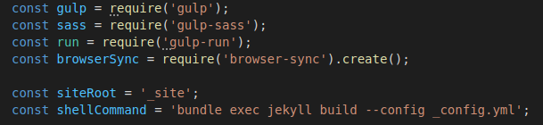

**Jekyll**

La construcción del sitio se realiza a traves de una tarea de gulp, lanzandola en el shell con el comando gulprun.

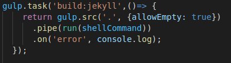

**Sass**

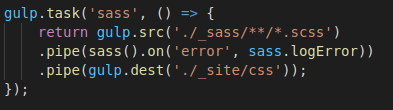

**Serve**

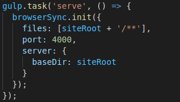

**Ejecución**

Se ejecutan en orden: Construcción del sitio, compilación de archivos Scss y por último lanzar el servidor

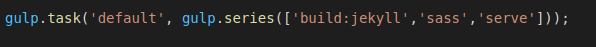

### 5. Desarrollo del proyecto

Se utilizaron 4 de los temas vistos en clase para que fuesen los componentes principales de la página, cada uno de ellos se creó dentro de la carpeta *"_character"* y se declararon para todos los mismos atributos en el Front Matter: título, descripción, imagen y link

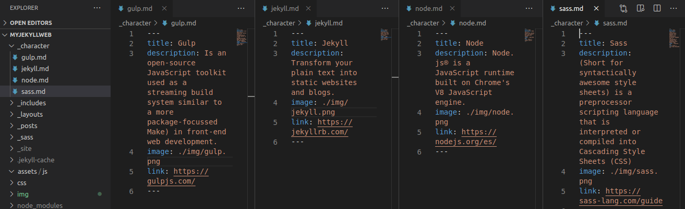

Dentro de la carpeta *"_pages"* se alojan las páginas que se verán en el NavigationBar, se declararon 2 con contenido por defecto

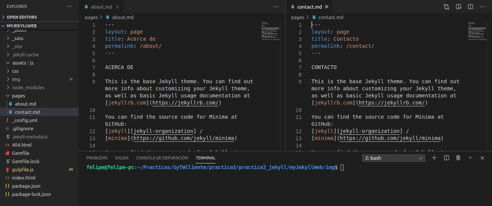

Dentro de la carpeta *"_layouts"* se encuentran los layouts que se definieron serian el default y los que se utilizan para ver el contenido de las páginas (*"_pages"*)

El layout *"default"* se construye a partir de 3 archivos html: head, body, footer.

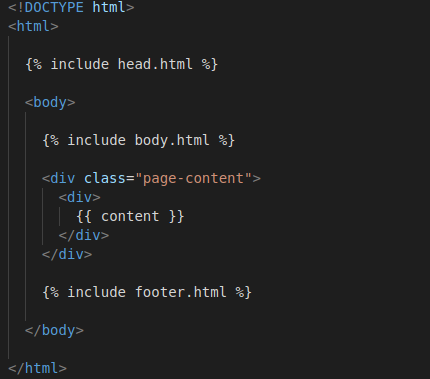

En el *"head"* y el "*footer*" se realiza la construcción de la cabecera y el pie de página, respectivamente.

En el *"body*" se realiza la construcción del NavigationBar , donde se llaman las páginas (*"_pages"*) y el título de la página

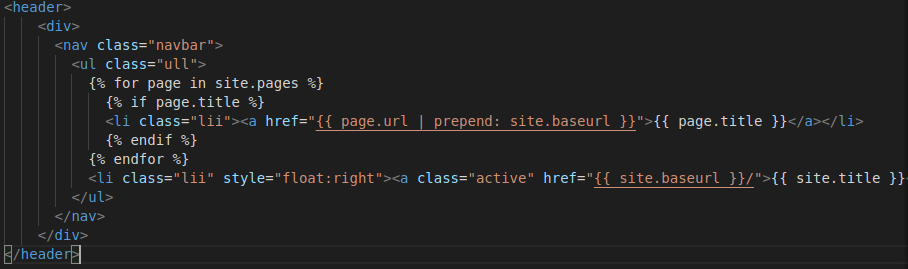

Por último, en el archivo *"index.html"*, se realiza un llamado a todos los componentes de la carpeta *"_character"* que serán los componentes de la página de inicio

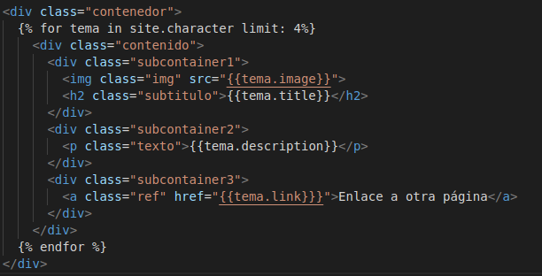

### 6. Resultado

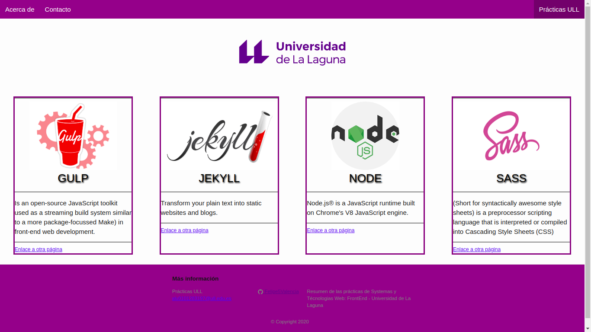 


